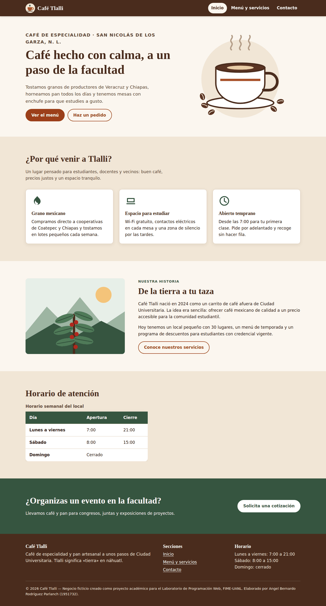
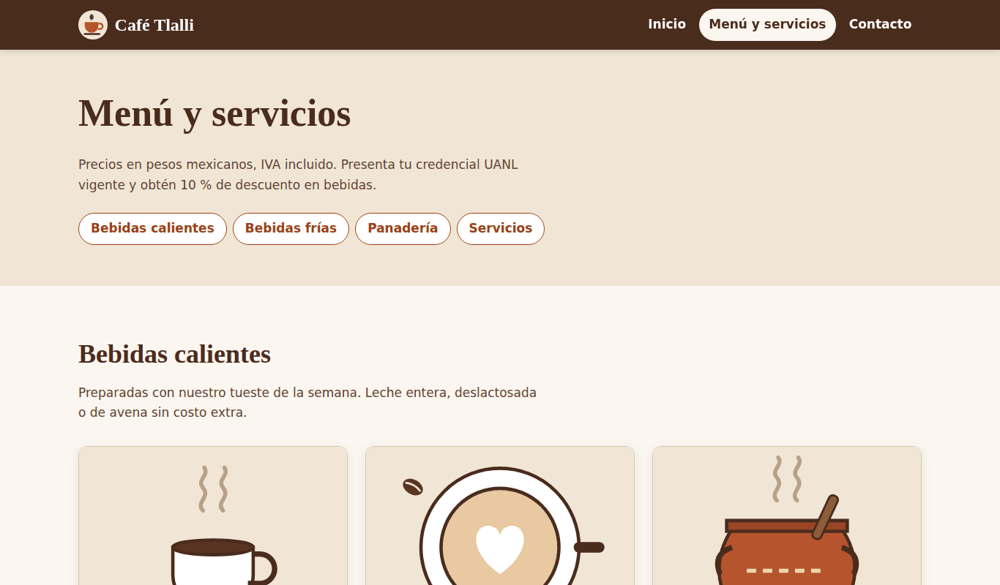
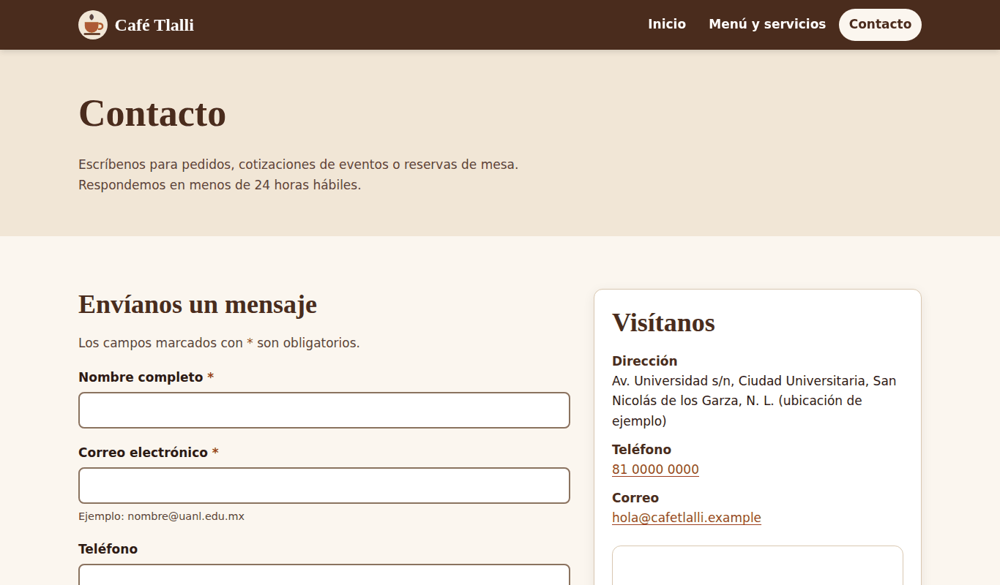
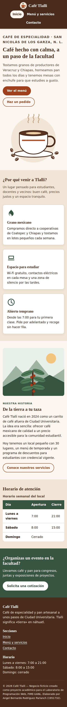
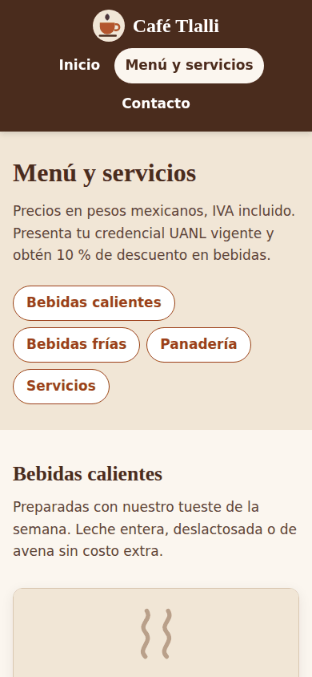
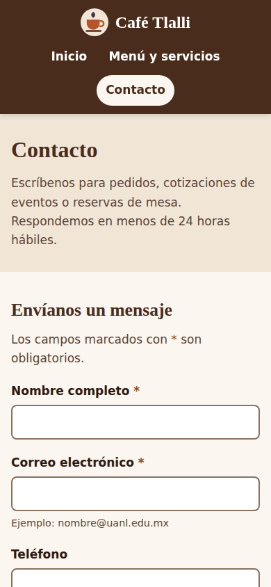

# Café Tlalli — Sitio web responsivo, semántico y accesible

**Laboratorio de Programación Web · Actividad 2**<br>
Unidad temática 2: herramientas para el desarrollo de páginas en Internet<br>
Facultad de Ingeniería Mecánica y Eléctrica (FIME) — UANL

| | |
|---|---|
| **Alumno** | Angel Bernardo Rodríguez Parlanch |
| **Matrícula** | 1951732 |
| **Carrera** | Ingeniería en Administración de Sistemas (IAS) |
| **Sitio publicado** | https://id0cool.github.io/cafe-tlalli/ |
| **Repositorio** | https://github.com/id0cool/cafe-tlalli |

> Café Tlalli es un negocio **ficticio** creado únicamente con fines académicos. *Tlalli* significa «tierra» en náhuatl.

---

## 1. Objetivo

Construir y publicar un sitio web responsivo utilizando **HTML5 semántico** y **CSS moderno** (Flexbox y Grid), aplicando principios básicos de usabilidad, accesibilidad y validación de estándares del W3C, para dar presencia web profesional a una cafetería cercana a Ciudad Universitaria que pueda consultarse correctamente desde computadora y teléfono móvil.

## 2. Caso elegido

**Cafetería de especialidad** para estudiantes, docentes y vecinos de Ciudad Universitaria (San Nicolás de los Garza, N. L.). El sitio permite conocer el negocio, consultar el menú y los servicios, y enviar un mensaje de contacto.

## 3. Vistas del sitio

| Página | Archivo | Contenido principal |
|---|---|---|
| Inicio | `index.html` | Presentación (hero), ventajas del negocio, historia, horario en tabla de datos y llamada a la acción. |
| Menú y servicios | `menu.html` | Índice interno, bebidas calientes, bebidas frías, panadería (tarjetas de producto con imagen, descripción y precio) y servicios. |
| Contacto | `contacto.html` | Formulario accesible (con validación nativa HTML5), datos de contacto en `<address>` y mapa de OpenStreetMap. |
| Confirmación | `gracias.html` | Página de respuesta al enviar el formulario (el sitio es estático; no se envían datos a un servidor). |
| Error 404 | `404.html` | Página personalizada que GitHub Pages muestra cuando una ruta no existe. |

## 4. Tecnologías y herramientas

- **HTML5** semántico
- **CSS3**: variables (custom properties), Flexbox, CSS Grid, `clamp()`, `min()`, `aspect-ratio`, media queries
- **SVG**: ilustraciones propias, ligeras y escalables
- **Visual Studio Code** como editor
- **Git y GitHub** para control de versiones
- **GitHub Pages** para el despliegue estático
- **W3C Markup Validation Service** y **W3C CSS Validation Service** para validar
- Navegador con herramientas de desarrollador (modo responsivo) para las pruebas en vista móvil

No se utilizan frameworks ni librerías externas: todo el diseño está hecho con CSS propio.

## 5. Estructura del proyecto

```
cafe-tlalli/
├── index.html          # Inicio
├── menu.html           # Menú y servicios
├── contacto.html       # Contacto (formulario + mapa)
├── gracias.html        # Confirmación del formulario
├── 404.html            # Página de error
├── css/
│   └── styles.css      # Hoja de estilos única (mobile-first)
├── img/                # Logo e ilustraciones SVG
├── docs/
│   └── capturas/       # Capturas para este README
└── README.md
```

## 6. Cómo se cumplieron los criterios

### 6.1 Estructura semántica HTML5 (20 %)

- Todas las páginas comparten la estructura `header` → `nav` → `main` → `footer`.
- El contenido se divide en `section` (cada una con encabezado y `aria-labelledby`) y `article` para elementos independientes (tarjetas de producto y de servicio).
- Se usan elementos específicos cuando corresponde: `address` para datos de contacto, `table` con `caption`, `thead`, `th scope` **solo para datos tabulares** (horario), `fieldset`/`legend` para agrupar opciones del formulario y `nav` secundarios con `aria-label` («En esta página» y «Pie de página»).
- Idioma declarado con `lang="es-MX"`, `meta viewport`, `title` y `meta description` únicos por página.

### 6.2 Diseño CSS y responsividad (25 %)

- Enfoque **mobile-first**: los estilos base son para teléfono y se amplían con dos breakpoints.
- **Flexbox**: encabezado y navegación, grupos de botones, sección de historia, tarjetas de producto (para alinear el precio al fondo) y opciones del formulario.
- **CSS Grid**: hero, rejillas de tarjetas con `repeat(auto-fit, minmax(...))`, rejilla de contacto y pie de página.
- **No se usan tablas para maquetar**; la única tabla es el horario, que es información tabular.
- Tipografía y espaciados fluidos con `clamp()`, y `min()` en rejillas e imágenes para evitar desbordes horizontales.

| Breakpoint | Ancho | Cambios principales |
|---|---|---|
| Base (móvil) | < 640 px | Una sola columna, navegación centrada, botones apilados. |
| Tableta | ≥ 40em (640 px) | Encabezado en una fila (logo a la izquierda, menú a la derecha), banda de llamada a la acción en fila, pie en 2 columnas. |
| Escritorio | ≥ 64em (1024 px) | Hero en 2 columnas, historia imagen + texto lado a lado, contacto formulario + información en 2 columnas, pie en 3 columnas. |

Se comprobó que en 390 px de ancho no existe desplazamiento horizontal en ninguna página.

### 6.3 Usabilidad y accesibilidad (20 %)

- **Textos alternativos** descriptivos en todas las imágenes con contenido; el logo junto al nombre y los íconos decorativos usan `alt=""` o `aria-hidden="true"` para no repetir información.
- **Formulario**: cada campo tiene su `label` asociado con `for`/`id`, `autocomplete`, tipos adecuados (`email`, `tel`), atributos `required`, textos de ayuda enlazados con `aria-describedby` y opciones agrupadas en `fieldset` con `legend`.
- **Jerarquía de encabezados** correcta: un solo `h1` por página, seguido de `h2` por sección y `h3` por tarjeta, sin saltos de nivel.
- **Navegación clara**: enlace «Saltar al contenido principal», menú fijo con la página actual marcada con `aria-current="page"`, índice interno en la página de menú y enlaces a todas las secciones en el pie.
- **Teclado**: estilo de foco visible (`:focus-visible`) en todos los elementos interactivos.
- **Objetivos táctiles** de al menos 44 px de alto en enlaces de navegación, botones y opciones del formulario.
- **Movimiento reducido**: se respetan las preferencias `prefers-reduced-motion`.
- El mapa (`iframe`) tiene un `title` descriptivo y un enlace alternativo para verlo en tamaño completo.

**Contraste de color** (calculado con la fórmula de WCAG 2.1; mínimo AA = 4.5:1 para texto normal):

| Combinación | Uso | Contraste | Resultado |
|---|---|---|---|
| `#2b1a12` sobre `#fbf6ef` | Texto principal | 15.5 : 1 | AAA |
| `#5c4436` sobre `#fbf6ef` | Texto secundario | 8.4 : 1 | AAA |
| `#9c3f1a` sobre `#fbf6ef` | Enlaces | 6.2 : 1 | AA |
| `#ffffff` sobre `#9c3f1a` | Botón principal | 6.7 : 1 | AA |
| `#ffffff` sobre `#4a2c1d` | Encabezado y pie | 12.6 : 1 | AAA |
| `#ffffff` sobre `#365540` | Banda verde y tabla | 8.3 : 1 | AAA |

### 6.4 Validación y calidad del código (15 %)

Ver la sección [8. Resultados de validación](#8-resultados-de-validación). Además: código indentado y comentado, una sola hoja de estilos organizada por secciones, variables CSS para colores y medidas, nombres de clases descriptivos y sin estilos en línea.

### 6.5 Publicación, repositorio y documentación (20 %)

Sitio desplegado con **GitHub Pages** desde la rama `main` (carpeta raíz). Liga pública: **https://id0cool.github.io/cafe-tlalli/**

## 7. Capturas

### Escritorio (1366 px)



| Menú y servicios | Contacto |
|---|---|
|  |  |

### Móvil (390 px)

| Inicio | Menú y servicios | Contacto |
|---|---|---|
|  |  |  |

## 8. Resultados de validación

Validación realizada sobre el sitio **ya publicado** en GitHub Pages (11 de septiembre de 2026). Cada enlace de la columna «Revalidar» vuelve a ejecutar el validador oficial del W3C con la versión actual del sitio.

### 8.1 HTML — W3C Nu Html Checker (validator.w3.org)

| Página | Errores | Advertencias | Revalidar |
|---|:---:|:---:|---|
| `index.html` | 0 | 0 | [Ver resultado](https://validator.w3.org/nu/?doc=https%3A%2F%2Fid0cool.github.io%2Fcafe-tlalli%2F) |
| `menu.html` | 0 | 0 | [Ver resultado](https://validator.w3.org/nu/?doc=https%3A%2F%2Fid0cool.github.io%2Fcafe-tlalli%2Fmenu.html) |
| `contacto.html` | 0 | 0 | [Ver resultado](https://validator.w3.org/nu/?doc=https%3A%2F%2Fid0cool.github.io%2Fcafe-tlalli%2Fcontacto.html) |
| `gracias.html` | 0 | 0 | [Ver resultado](https://validator.w3.org/nu/?doc=https%3A%2F%2Fid0cool.github.io%2Fcafe-tlalli%2Fgracias.html) |
| `404.html` | 0 | 0 | [Ver resultado](https://validator.w3.org/nu/?doc=https%3A%2F%2Fid0cool.github.io%2Fcafe-tlalli%2F404.html) |

Resultado: **«Document checking completed. No errors or warnings to show.»** en las cinco páginas.

### 8.2 CSS — W3C CSS Validation Service (jigsaw.w3.org), perfil CSS nivel 3 + SVG

| Archivo | Errores | Advertencias | Revalidar |
|---|:---:|:---:|---|
| `css/styles.css` | 0 | 6 (informativas) | [Ver resultado](https://jigsaw.w3.org/css-validator/validator?uri=https%3A%2F%2Fid0cool.github.io%2Fcafe-tlalli%2Fcss%2Fstyles.css&profile=css3svg&usermedium=all&warning=1&lang=es) |

Resultado: **«¡Enhorabuena! No error encontrado. ¡Este documento es CSS versión 3 + SVG válido!»**

### 8.3 Correcciones realizadas a partir de la validación

La primera validación del CSS dio **0 errores y 12 advertencias**. Se corrigieron las 6 que tenían solución:

| Advertencia del validador | Corrección aplicada |
|---|---|
| `The property clip is deprecated` / separador inválido en `rect()` | Se reemplazó `clip: rect(0 0 0 0)` por `clip-path: inset(50%)` en la clase `.visually-hidden`. |
| `dynamic values cannot be checked as an unitless number` | El contenedor dejó de usar `min(100% - 2 * var(--espacio), …)`; ahora usa `max-width` + `padding-inline`. |
| `Colores iguales para background-color y border-color` (3 casos) | Los botones usan un borde transparente por defecto y solo el botón secundario define color de borde. |

Las **6 advertencias restantes** dicen *«Due to their dynamic nature, CSS variables are currently not statically checked»*: solo informan que el validador no puede revisar los valores de las variables CSS (`var(--…)`). No son errores y no afectan la validez del documento.

## 9. Cómo ver el proyecto localmente

1. Clonar el repositorio: `git clone https://github.com/id0cool/cafe-tlalli.git`
2. Abrir `index.html` en el navegador, o usar la extensión *Live Server* de Visual Studio Code.

## 10. Créditos

- Diseño, código e ilustraciones SVG: Angel Bernardo Rodríguez Parlanch.
- Mapa: © colaboradores de [OpenStreetMap](https://www.openstreetmap.org/copyright).
- Negocio, precios, dirección y datos de contacto ficticios.
